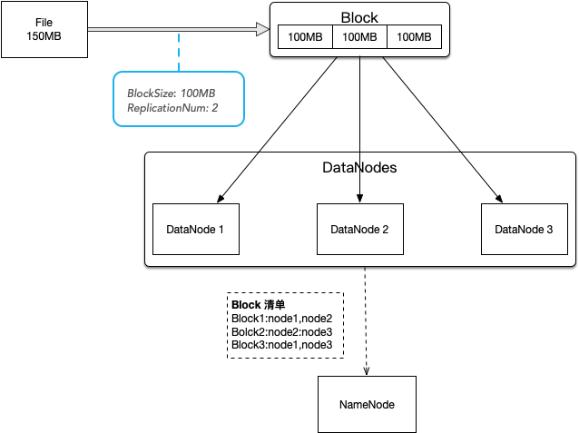
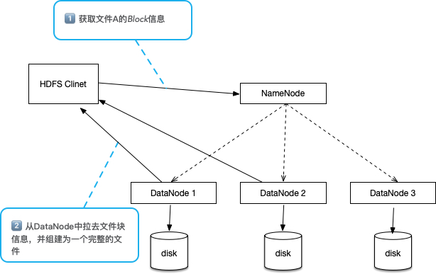

### Hadoop 模块

-   Hadoop Common：基础工具模块
-   Hadoop Distributed File System（HDFS）：分布式文件系统
-   Hadoop Yarn：一个分布式框架，负责任务调度和集群资源管理
-   Hadoop MapReduce：大数据并行计算框架，基于 Yarn

### HDFS 存储模型

存储在HDFS中的文件被 **线形切割** 为多个 **块（Block）**，通过块的 **偏移量（Offset）** 来对文件进行访问。文件在上传时，需要指定块的大小（默认：128MB），**一旦指定了一个文件的块大小则永远不能够改变。**

>   脑子里要有映射：偏移量（Offset） --> 块（Block）

块存储在HDFS中有多个副本（默认：3个），副本与副本之间不存在“主从关系”，但是副本的分布需要满足：

-   同一个数据节点下，只能有一个副本
-   副本数必须小于存数据点数目

文件只能允许写一次，不允许修改，只能追加，可多次读取。并且，**同一时刻，只能有一个写入者，不能并行写入。**

>   Block Size 不能修改、文件不能修改、不能并行写入，从本质上将即：文件任何操作不能对 Block Offset 造成影响，否则文件将无效

### HDFS 架构模型

HDFS采用 **主从架构** 模式：

-   NameNode：HDFS中的主节点，单节点。保存HDFS文件的元数据，维护了一个虚拟的“文件目录树“。文件存入HDFS后，Linux文件系统并不能找到该文件，只能通过NameNode节点中找到。
-   DataNode：HDFS中的从节点，多节点。保存文件的Blocks

NameNode和DataNode通过”心跳“的方式保持连接。并且通过心跳过程，DataNode向NameNode传递”Block清单“信息。

当 HDFS Clint 向 HDFS 请求获取一个文件时：

1.  与NameNode交互，获取文件的Block信息
2.  与DataNode交互，拉去文件内容

