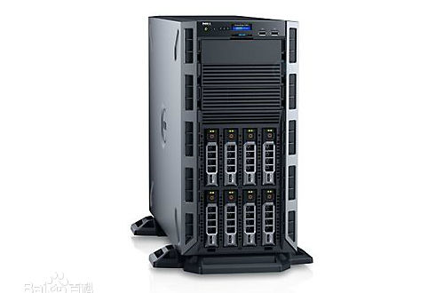
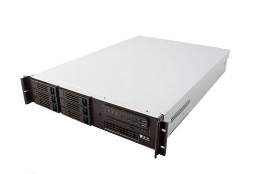
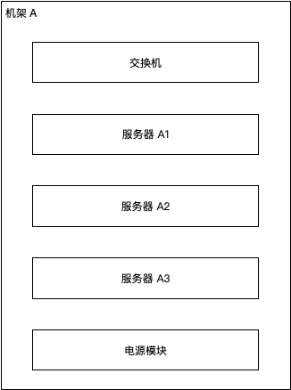
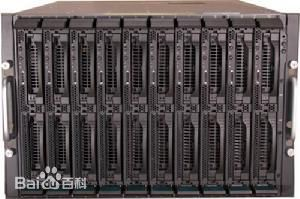
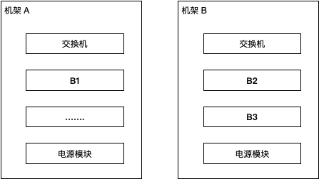

## Block 副本放置与部署架构

Block 以多个副本放置在不同的数据节点，其目的就是为了高可用。为了真正达到高可用的目的，不仅要从节点上，而且还要对目前主流服务器机器部署情况进行了解。

服务器宕机的本质是 **服务器中的服务不可达**。因此，不仅要从分布式的角度，还要从硬件部署架构上来考量 Block 副本的放置问题。

### 服务器类型

服务器类型的划分方式很多。由于讨论的是服务器部署架构问题，这里只针对 **机箱** 类型划分与说明。

#### 塔式服务器

塔式服务器可以简单的理解为一个 **没有任何外设的主机**。它的配置比家用主机要高，扩展槽丰富，比较占空间，对于扩展各种硬件十分方便。

#### 机架式服务器(常用)

机架式服务器节省空间，放置在机柜里，但是存在散热问题。一个机架中会有多台架式服务器，它们共用机架内的电源模块和交换机。

#### 刀片式服务器

刀片服务器最小，排列最整齐，价格便宜。

但是刀片服务器必须使用指定的刀片机箱，不同的刀片服务器要使用不同的刀片机箱，机箱成本本身也比较大。并且，刀片服务器升级更新较快，刀片机箱也要随着更新。也就意味着更换一批刀片服务器可能相对便宜，更多的资金用于购买与之相匹配的刀片机箱上面了。

## Block 副本放置策略

Block 副本放置策略基于机架服务器。

Block 默认为 3 个副本，为易区分设为：B1、B2、B3，其中 B1 位于机架 A中，B2、B3 位于机架 B 中。这样做的目的有两个：

*   B1、B2 之间分别使用了不同的电源和网络设备，更大程度上避免机架故障导致副本不可用
*   B2、B3 存放在同一机架中，共用一个交换机设备，加快了副本的同步速度

