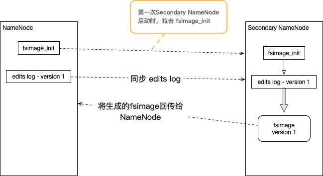

## Hadoop 模块

-   Hadoop Common：基础工具模块
-   Hadoop Distributed File System（HDFS）：分布式文件系统
-   Hadoop Yarn：一个分布式框架，负责任务调度和集群资源管理
-   Hadoop MapReduce：大数据并行计算框架，基于 Yarn

## HDFS 存储模型

存储在HDFS中的文件被 **线形切割** 为多个 **块（Block）**，通过块的 **偏移量（Offset）** 来对文件进行访问。文件在上传时，需要指定块的大小（默认：128MB），**一旦指定了一个文件的块大小则永远不能够改变。**

>   脑子里要有映射，提到块就要想到偏移量：块（Block） --> 偏移量（Offset）

块存储在HDFS中有多个副本（默认：3个），副本与副本之间不存在“主从关系”，但是副本的分布需要满足：

-   同一个数据节点下，只能有一个副本
-   副本数必须小于存数据点数目

文件只能允许写一次，不允许修改，只能追加，可多次读取。并且，**同一时刻，只能有一个写入者，不能并行写入。**

>   Block Size 不能修改、文件不能修改、不能并行写入，从本质上讲即：文件任何操作不能对 Block Offset 造成影响，否则文件将无效

## HDFS 架构模型

HDFS采用 **主从架构** 模式：

-   NameNode：HDFS中的主节点，单节点。保存HDFS文件的元数据，维护了一个虚拟的“文件目录树“。文件存入HDFS后，Linux文件系统并不能找到该文件，只能通过NameNode节点中找到。
-   DataNode：HDFS中的从节点，多节点。保存文件的Blocks

NameNode和DataNode通过”心跳“的方式保持连接。并且通过心跳过程，DataNode向NameNode传递”Block清单“信息。

当 HDFS Clint 向 HDFS 请求获取一个文件时：

1.  与NameNode交互，获取文件的Block信息
2.  与DataNode交互，拉去文件内容

### NameNode

NameNode是基于内存存储的，如果不讨论持久化问题，基本上与磁盘交互的很少，因此也保障了它高效的性能。

NameNode主要用于接收Clinet的读写服务，将元数据提供给HDFS Client；并且，接收来自DataNode的心跳信息，保持Block信息的时效性。

NameNode中存储的元信息主要有：

-   文件属性信息：文件的大小、修改时间、权限等等
-   Block 属性：Block 位置（offset）和Block 副本位置

#### NameNode 的持久化与恢复

NameNode作为整个HDFS的“大脑”，一旦宕机则会导致整个分布式文件服务不可用。但由于NameNode是基于内存存储，宕机后的恢复尤为重要。为此，Hadoop通过使用 **快照（fsimage）** 和 **日志信息（editslog）** 的方式来将NameNode存储在内存的数据持久化。

**快照（fsimage）** 会将当前NameNode中的当前状态存储在磁盘中，但是 **Block位置信息不会被快照收集**。

在NameNode运行时期，NameNode会通过 **日志信息（editslog）** 记录运行时状态的变化。换而言之，快照记录了历史信息，日志实时记录了运行信息。快照 + 日志，才是当前NameNode的状态。

NameNode 首次启动时需要进行格式化，格式化后会生成 **第一份快照（fsimage）**。当NameNode再次被启动时会加载 fsimage和editslog，恢复上次关闭前的状态。并根据 **快照+日志** 生成下一份快照存储在磁盘中。

>   注意：无论 fsimage 还是 editslog，都没有存储 Block list 信息。NameNode 的 Block list 信息是通过 DataNode 上报获取的，这样保证了 Block list 信息的时效性

#### NameNode 启动过程

1.  首次启动 —> 格式化 —> 生成空 fsimage 和空 edis log —> 运行，并在运行期间追加 edits log
2.  再次启动 —> 加载 fsimage 和 edits log —> 生成新的 fsimage —> 等待获取 Block list

#### NameNode 安全模式

NameNode 启动过程中，处于一种 **安全模式（safe mode）** 下，该模式下 **所有文件只有只读权限**。当 Block list 获取完成后，NameNode 将退出安全模式。

### DataNode

DataNode 主要存储 Block 数据和 Block 信息（例如：Block MD5）。

DataNode 会定时发送一条心跳信息给 NameNode，如果一段时间内没有发送心跳信息，NameNode 则认为该DataNode 节点已经失联，会将该 DataNode 中的所有 Block 副本在其他 DataNode 节点中创建。

### Secondary NameNode

NameNode 只在启动时才合并 edits log 到 fsimage 中，启动期间 NameNode 处于不可用访问的"安全状态"，如果 edits log 非常大，恢复时间会很长。

为了保证 NameNode 快速的启动，Secondary NameNode 作为 NameNode 的"秘书"，不断的将 NameNode 的 edits log 收集起来，并合成新的 fsimage，将最新的 fsimage 传回 NameNode。

## Tick, Tick

讲故事将就先点后面，把角色与角色背景介绍后，再介绍角色与角色之间的关系，这样脉络才会清晰。本篇重点讲解 Hadoop 

## 版权声明

本作品采用<a rel="license" href="http://creativecommons.org/licenses/by-nc/4.0/">知识共享署名-非商业性使用 4.0 国际许可协议</a>进行许可。

   感谢支持！

