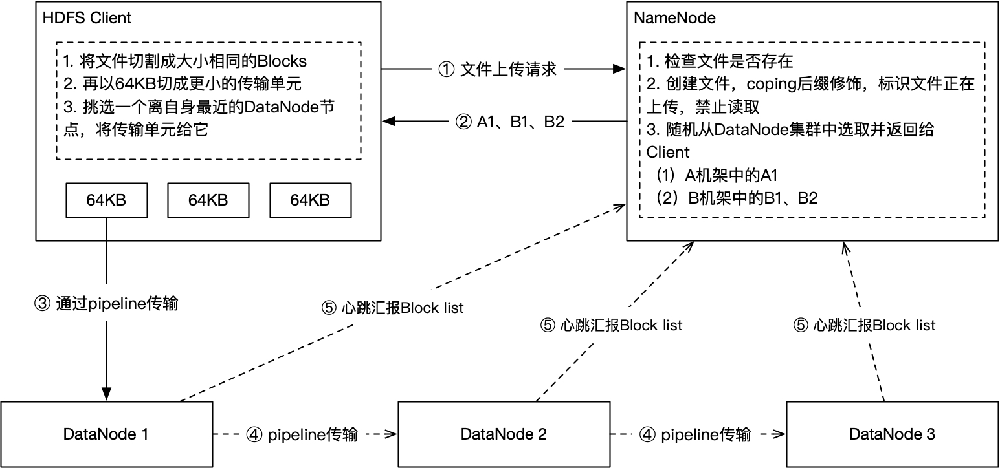
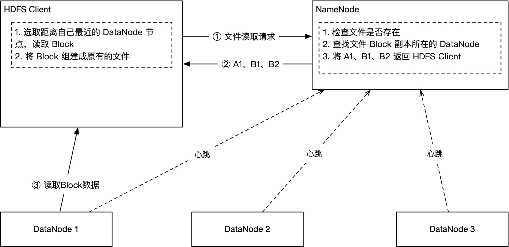

## HDFS 文件写入流程

文件写入分为两个阶段：**请求阶段** 和 **写入阶段**。

### 请求阶段

由 HDFS Client 向 NameNode 发起"文件上传"请求，然后 NameNode 返回 **写入阶段** 需要用到的服务器列表。

详细过程如下：

1.  HDFS Client 向 NameNode 发起文件上传请求
2.  NameNode 检查文件是否存在，若存在则直接返回"文件已存在"，终止上传操作
3.  文件不存在，NameNode 在"虚拟文件系统"中创建该文件，并将文件名以后缀 `coping` 结尾，标志该文件正在创建中，不能够被访问。
4.  NameNode 随机选取 A 机架中的 A1 和 B 机架中的 B1、B2 服务器，作为该文件 Block 存储的 DataNode 存储节点，返回给 HDFS Client

### 写入阶段

HDFS Client 拿到 DataNode 资源后，将文件按照配置切割成大小相等的 Blocks。然后，传输给其中的一个 DataNode 节点。在 DataNode 接收到 Block 数据后创建 Block 副本。最后，DataNode 将 Block 副本通过 pipeline 的方式传输给另外一个台 DataNode 节点，以此类推。

详细过程如下：

1.  HDFS Client 将文件切割成 Blocks，**再将 Blocks 切割成 64KB 的数据包**
2.  HDFS Client 从 NameNode 提供的 DataNode 列表中随机选取一个节点，假设是 A1
3.  HDFS Client 将一个个 64KB 数据包传输给 A1
4.  A1 在接到数据包的同时，开启 pipeline，向下一个 B1 节点同步数据。
5.  B1 节点接收到数据后，也开启 pipeline，向最后一个节点 B2 同步数据
6.  HDFS Client 传输完毕后，断开了与 A1 的连接
7.  A1、B1、B2 通过心跳的方式，向 NameNode 汇报 Block list
8.  同步完成后，NameNode 将得到完整的 Block 信息，NameNode 删除 `coping` 后缀，文件传输完成

#### 时间叠加

C —> A1 —> B1 —> B2 整个传输过程是有时间重叠的，DataNode 之间通过 pipeline 实时传输，从而大大提高了传输效率。

#### 再分割

事实上 HDFS Client 并没有直接传输 Blocks，而是将 Block 切割成了一个个 64KB 大小的小数据包，然后再进行传输。这样做的好处在于：**充分利用时间重叠特性，将文件传输效率达到极致，大大缩短了因创建副本所需要的中间时间**。

我们假设没有 **再分割** 与 **时间叠加**，如果需要保存 N 副本，则需要 `N * T` 的传输时间（T 为单个副本传输耗时）。

因此，再分割和时间叠加方案，理想情况下，将总时间缩短到：`T + t * (N - 1)`（t  为单个 64KB 数据包传输的时间）

#### 自动故障转移

HDFS Client 随机挑选一个 DataNode 节点（假定是 A1 节点），然后开始传输数据。当 A1 节点故障时，HDFS Client 会自动切换到另外两个 DataNode 节点，最大程度保证写入阶段的稳定性。

## HDFS 文件读取流程

文件读取也分为两个阶段：**请求阶段** 与 **读取阶段**。

HDFS Client 先通过 NameNode 获取 Block 副本所在的 DataNode 列表，然后选择离自己最近的 DataNode 读取 Block 副本，最后将 Block 副本组建成原来的文件。

