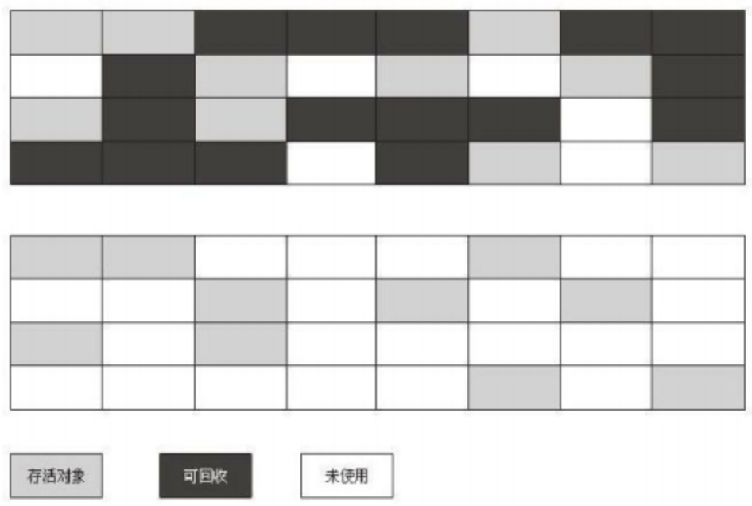

# JVM 内存回收

## JVM 内存模型

JVM Standard Specification 中，JVM 运行时的内存分为 5 部分，具体可以记做 3 + 2：

*   3 块线程独享：程序计数器、Java 虚拟机栈、本地方法栈，随着线程的创建而创建，线程执行结束时自动清除，不需要 GC 参与
*   2 块线程共享：Java 堆、方法区，所有线程在执行时共享该内存

### 程序计数器（Program Counter Register）

线程独享，用于记录当前线程执行代码的行号。线程挂起时，记录当前线程执行的字节码行号，方便后续线程恢复。

### Java 虚拟机栈（Java Virtual Stacks）

线程独享：栈结构，栈内存储的元素称为 **栈帧（Stack Frame）**，一个栈帧元素包含了：

*   局部变量表：存储方法中的局部变量，包括方法参数、方法内的局部变量。8 大基本类型直接存储值，引用类型存储指针，指向 Heap 中对象
*   操作数栈：执行方法时，操作数栈用于完成方法内每一个操作的执行
*   动态链接：Java 语言支持继承，即允许一个接口引用或父类引用指向一个子类对象。动态链接用于找到引用指向的那个确切的类类型
*   方法出口

### 本地方法栈（Native Method Stack）

线程独享，与 Java 虚拟机栈很相似，区别在于本地方法栈仅用于执行本地方法。

### Java 堆（Java Heap）

线程共享，GC 的主战场，所有对象的创建都在这里完成。

基于分代收集的 Java 堆中，将 Java 堆分为新生代和老年代。更细化一些，新生代可以划分为：Eden（伊甸园）、Survive 1（存活区 1）、Survive 2（存活区 2）。

经过对“对象创建情况分析后发现，大部分对象都是朝生夕死，因为通过为对象划分年龄代能提高 GC 效率。新创建的对象往往在 Eden 中创建，就如它的名字一样，这里是所有对象的伊甸园。当经过一次 GC 洗礼后，幸存的对象成功进入 Survive 1 区。如果经过几次的 GC 对象总是能够幸存下来，则会被放入到老年代中。

### 方法区

线程共享，类加载后的信息、运行时常量池（Run-time Contant Pool）都会存放在这里。Jdk 1.7 以后，运行时常量池改为在 Heap 中存储。

方法区其实是堆逻辑中的一部分，为了和堆区分，通常将其称为 No-Heap。Hotspot 中把方法区称为 **永生代（Permanent Generation，简称 PermGen）**，永生代是继新生代、老年代之后的第三代，永生代存储的静态、常量数据并非会永久保存的，Hotspot 如此命名是为了将永生代也列入 GC 的范围之内。

Hotspot 在 JDK 1.8 以后，将方法区（Method Area）移出了 JVM，放在了本地内存中：

## JVM 垃圾回收算法

垃圾回收算法是所有垃圾收集器的算法基础，是所有垃圾回收原始的、算法层面的解决方案。垃圾回收算法具有环境的局限性，在某些使用环境和处理器的情况下，会有非常出色的表现。因此很难界定哪一个回收算法是最好的。

### 可回收状态判定算法

下面介绍的算法是一个用于判断一个对象是不是处于 **可回收状态**。我们不再使用的对象，是允许进行 GC 回收。因此我们可以界定：**不再使用的对象处于可回收状态**。

#### 引用计数法

引用计数是通过统计 **外界引用** 的数量来判断对象是否可回收。当有一个新的引用指向对象 A 时，引用计数加 1，反之减 1。当引用小于等于 0 时，该对象会被 GC 回收。

在 Java 语言层面，允许 4 中引用的存在：强引用、软引用、弱引用、虚引用。引用计数与这些引用类型相关。[Java的引用与回收](./Java 的引用与回收.md) 中详细介绍了这些内容。

#### 可达性分析法

基本思想：通过一系列的称为 **GC Roots** 的对象作为起始点，从这些节点开始向下搜索，搜索所走过的路径称为引用链（Reference Chain)，当一个对象到GC Roots没有任何引用链时，则证明此对象是不可用的。

在 Java 中，可作为 GC Roots 的对象包括下面几种：

1.  虚拟机栈（栈帧中的局部变量表）中引用的对象
2.  方法区中类静态属性引用的对象
3.  方法区中常量引用的对象
4.  本地方法栈中 JNI（即一般说的 Native 方法）引用的对象

### 垃圾回收算法

#### 标记清除算法

当没有引用指向对象 A，垃圾收集器会把 A 对象标记为可回收状态，下次 GC 时会清理被标记的对象。

下面是标记清除算法回收前后的情况（深色部分为可回收状态对象），该算法会产生大量的内存碎片，一般用于 **老年代**。

#### 标记-整理算法

标记-整理算法让所有存活的对象都向一端移动，然后直接清理掉端边界以外的内存。

相对于标记-清除的优势在于：避免了内存碎片的产生。该算法一般用于 **老年代**。

#### 复制算法

它将可用内存按容量划分为大小相等的两块，每次只使用其中的一块。当这一块的内存用完了，就将还存活着的对象复制到另外一块上面，然后再把已使用过的内存空间一次清理掉。

该算法需要浪费 1/2 的内存空间，代价较大，效率很高。

现在的商业虚拟机都采用这种收集算法来回收新生代。将内存分为一块较大的 **Eden（伊甸园）** 空间和两块较小的 **Survivor** 空间，每次使用 Eden 和其中一块 Survivor。 当回收时，将 Eden 和 Survivor 中还存活着的对象一次性地复制到另外一块 Survivor 空间上，最后清理掉 Eden 和刚才用过的 Survivor 空间。

HotSpot 虚拟机默认 Eden 和 Survivor 的大小比例是 8: 1。 当 Survivor 空间不够用时，需要依赖其他内存（这里指老年代）进行 **分配担保（ Handle Promotion）**。 如果另外一块 Survivor 空间没有足够空间存放上一次新生代收集下来的存活对象时，这些对象将直接通过分配担保机制进入老年代。

#### 分代收集算法

分代收集算法说一种回收策略，并非一种新的回收算法。

主要思想是通过将 JVM 划分为新生代和老年代，对不同的年龄代使用不同的算法。例如，在新生代中通常使用复制算法，在老年代中通常使用标记清理或标记整理算法。

### 分配担保

在 Monitor GC 中，为避免因保留区 Survivor 空间不足导致 GC 失败，需要在每次 Monitor GC 前检测老年代的连续空间是否可以容纳新生代的对象。

老年代需要对新生代内存不足的时的借用情况进行担保。担保有两个过程：

1.  如果老年代的连续内存空间大于 Monitor GC 前新生代的总对象大小，则可以进行担保
2.  如果老年代的连续空间不足，并且设置了 `HandlePromotionFailure=true`，则将历次进入老年代对象大小的平均值与老年代的剩余连续空间做对比，如果空间足够则进行担保
3.  1 和 2 都不符合要求，则进行一次 FullGC
4.  如果 **平均值** 的方式担保失败，即晋升到老年代的对象大于历次进入老年代对象大小的平均值，则进行 FullGC，这是分配担保算法最坏的场景

在 JDK 1.6 Update 24 以后，`HandlePromotionFailure` 参数不再影响 JVM 的分配担保策略。

## Tick, Tick

本篇重点讲解 JVM 内存回收的一些基本概念，并未涉及更多的 JVM 垃圾收集器内容，具体的垃圾收集器请参看 [JVM 垃圾收集器家族](JVM垃圾收集器家族.md)。

## 扩展阅读

[JVM 学习——垃圾收集器与内存分配策略](http://matt33.com/2016/09/18/jvm-basic2/)

[可能是把Java内存区域讲的最清楚的一篇文章](https://github.com/Snailclimb/JavaGuide/blob/master/Java%E7%9B%B8%E5%85%B3/%E5%8F%AF%E8%83%BD%E6%98%AF%E6%8A%8AJava%E5%86%85%E5%AD%98%E5%8C%BA%E5%9F%9F%E8%AE%B2%E7%9A%84%E6%9C%80%E6%B8%85%E6%A5%9A%E7%9A%84%E4%B8%80%E7%AF%87%E6%96%87%E7%AB%A0.md)

## 版权声明

本作品采用<a rel="license" href="http://creativecommons.org/licenses/by-nc/4.0/">知识共享署名-非商业性使用 4.0 国际许可协议</a>进行许可。

   感谢支持！

