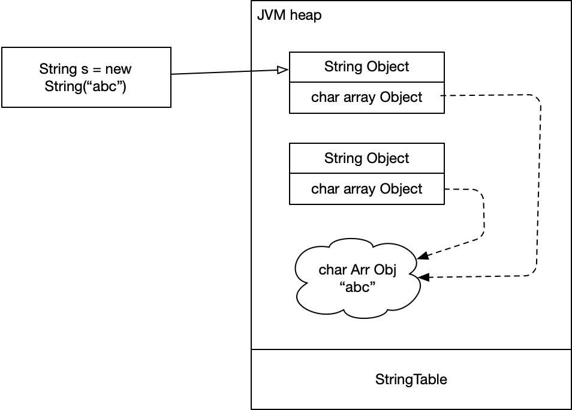

### String s = new String("hello") 到底发生了什么？

`new String(...)` 创建了 3 个对象：

*   s 指向的 String Obj
*   解释执行时，将 "abc" 池化时需要的 String Obj
*   两个 String Obj 内部所需要的 char array 对象，该对象如果来自 .class 字节码内部（.class 中有 `String s = new String("abc")` 和 `String s = "abc"` 两种创建字符串的方式），会共用同一个 char array 数组对象

在解释执行期间，会将字节码中的所有字符串池化，无论是 new 还是直接赋值的方式。该过程如下：

*   判断 "abc" 在 String Table 中是否已存在：如果存在，则直接返回；否则，继续执行
*   将当前的字符串 "abc" 在 Heap 中创建一个 String 类型的对象，并用名为 handle 指针指向它
*   将 "abc" 的 hashcode 作为 key，handle（即 "abc" 的地址）作为 val，存储在 StringTable 中

`String.internal()` 方法经历的过程与上面过程相同。

>   非字节码中的字符串（例如：从文件中读取的字符串）由于无法在解释期间识别，因此会重新创建 String Obj 和 Char Array Obj，Char Array Obj 不会复用之前的对象。
>
>   JDK 1.7 以后，StringTable 从 PermGen 移到了 Heap 中。