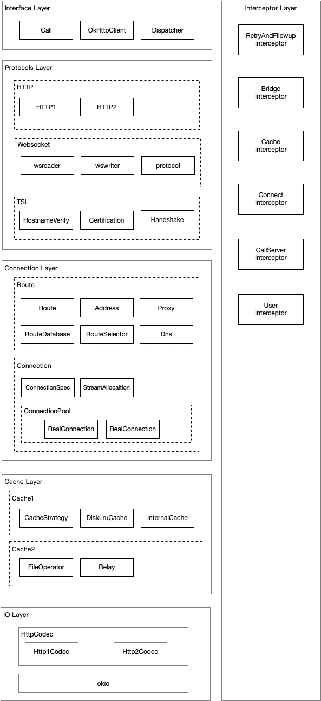
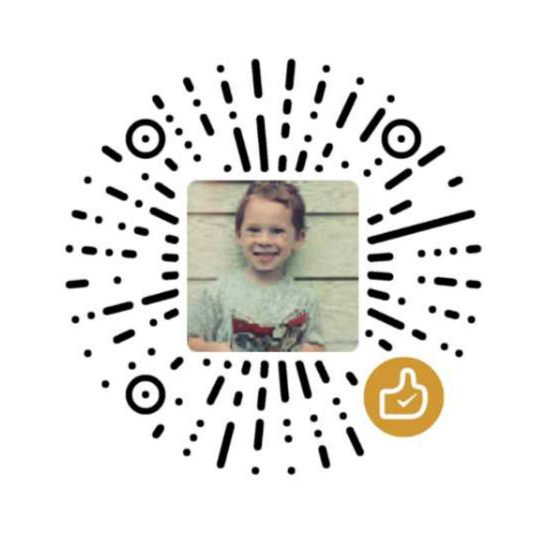

# OkHttpClient3 架构简介

OkHttp 旨在提供简单、稳定、高效的 HTTP Client 服务，并且支持 HTTP 2.0 以及 WebSocket。

## 总体架构分 6 层

Protocols Layer 涵盖了 OkHttp 支持的所有“功能”，实现了复杂的协议通讯和 TSL 握手与验证。

Connection Layer 为“稳定、高效”而努力。除了单纯的实现了链路通讯，还实现了连接池（ConnectionPool）、链路复用（StreamAllocation）、失败链路黑名单（RouteDatabase）。

Cache Layer 用于缓存 Response，提高请求效率。

IO Layer 是基于 okio 的 IO 层，属于基础模块。

Interface Layer 是面向用户的接口层，目标是为用户提供简单的 API。OkHttp 将所有的需要暴露给用户的接口全部集中在了 `OkHttpClient`，方便用户的使用。`OkHttpClient` 类是**外观模式**的一个优秀案例。

Interceptor Layer 是其他 5 层的纽带，贯穿了整体的请求与响应流程。将这一复杂流程巧妙的划分为 5 部分，然后用拦截器分别实现各个子流程。同时，暴露给用户，方便用户接入自己的拦截器。

下图简单展示了请求与响应在 Interceptor 中的过程。

## 拦截器简介（选读）

-  RetryAndFllowupInterceptor：创建 Stream、失败重试和重定向
-  BridgeInterceptor：从网络模型来看，它是传输层和应用层的桥梁，负责将用户的 Request 转换成网络可以理解的 Request；将来自网络的 Response 转换成易于用户使用的 Response
-  CacheInterceptor：缓存获取与插入
-  ConnectInterceptor：开启一个连接，即从 Stream 中获取一个 RealConnection
-  CallServerInterceptor：最后一个拦截器，用于向服务器发起原始的请求，并接收原始的响应

## 系统架构图

## Tick, Tick

学习的过程应当尽可能的从宏观到微观。把握整体的脉络，走进了迷宫里才能方寸不乱，有张有弛。本篇从俯视的角度去了解 OkHttp。从**它到底想解决什么问题**开始，到它的整体设计如何围绕这些核心命题而展开。

“宏观到微观，问题驱动”，笔者的心得。欢迎大家一起分享自己的学习技巧，互相学习。

## 扩展阅读

[OkHttpClient3 连接池模型](./OkHttpClient3连接池模型.md)

## 版权声明

本作品采用<a rel="license" href="http://creativecommons.org/licenses/by-nc/4.0/">知识共享署名-非商业性使用 4.0 国际许可协议</a>进行许可。

   感谢支持！

