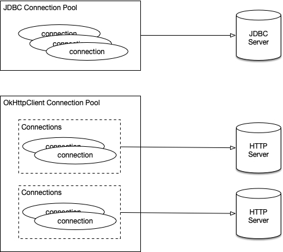
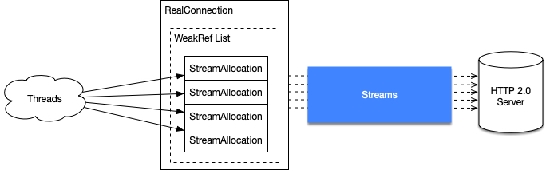

# OkHttpClient3 连接池模型

OkHttp 的连接池与 JDBC 连接池有所不同。JDBC 的连接池往往面向**单一目标**服务器，而 OkHttp 中，多数情况下 HTTP 请求需要面向多台不同的服务器，因此 OkHttp 的连接池需要面向**多目标**。



## 获取连接

`StreamAllocation#findConnections()`方法用于获取一个**连接（RealConnection，本文简称 cnn）**，cnn 可能来自线程池，创建新连接。

### HTTP 2 连接复用

> OkHttp 的连接复用与连接的创建和回收过程关联紧密，并且还涉及到了一个大角色——`StreamAllocation`

HTTP 2.0 中，一个连接可以同时发送多个请求。所以 OkHttp 需要解决：如何让一个连接被多个线程使用，同时要确保线程安全，以及准确及时的回收**空闲连接**。

cnn 的复用是通过 `StreamAllocation` 实现的。`StreamAllocation` 可以看作是 cnn 的一个“分身”，一个 cnn 拥有众多的 `StreamAllocation`。用户使用连接的时，会获取 `StreamAllocation`，从而获取它背后真正的 cnn与服务器通讯。



下面从 Java 层面展示了两者的关系。

```java
/* RealConnection class */
public final class RealConnection extends Http2Connection.Listener implements Connection {
    /** Current streams carried by this connection. */
    public final List<Reference<StreamAllocation>> allocations = new ArrayList<>();
	...
}

/* StreamAllocation class */
public final class StreamAllocation {
    private RealConnection connection;
    ...
}
```

一个 cnn 拥有一组 `StreamAllocation` 软连接集合， `StreamAllocation` 持有唯一一个 cnn。当**用户**获取一个连接时，会向特定的一个 `StreamAllocation` 发出申请，然后返回一个真正当连接。多个线程间可能会从不同的 `StreamAllocation` 获取同一个 cnn。一个线程持有一个**唯一**  `StreamAllocation`。

>  这里的用户是广义的，泛指连接的需求方，通常是一个线程。而并非真实的一个用户。

## 连接销毁

> 我们采用“倒叙”的方式铺开连接池的管理，从销毁讲起，后面还包括：连接的获取、连接的创建和线程安全保障

cnn 维护在 `ConnectionPool#connections` 中，数据结构如下：

```java
public final class ConnectionPool {
	private final Deque<RealConnection> connections = new ArrayDeque<>();
    ...
}
```

完成这个清理工作的，是一个线程，它的处理方式很简单：

1. connection pool 中没有任何**空闲连接**时，线程关闭

2. connection pool 中没有**待清理**的连接时，线程等待（waiting，默认等待 5 min）

3. connection pool 中存在**需要清理**的连接时，执行清理任务

4. 当有新的 cnn 加入到 connection pool 时，清理线程开启。

```java
public final class ConnectionPool {
    ...
    void put(RealConnection connection) {
        assert (Thread.holdsLock(this));
        if (!cleanupRunning) {
            cleanupRunning = true;
            // start the cleanup thread
            executor.execute(cleanupRunnable);
        }
        connections.add(connection);
    }
    ...
}
```

连接池清理工作包括：**寻找无效连接**和**销毁无效连接**，空闲连接的判断是第一步的核心。

cnn 维护了一个 `StreamAllocation` **软连接集合**用于对连接的使用情况进行追踪与计数。当没有任何线程使用 cnn 时，无法从集合中获取**未被回收**的 `StreamAllocation` 对象 。通过这样当方式，我们可以轻松的判断：”当前连接是否是处于空闲状态？“。

OkHttp 是允许部分空闲连接的存在的，只有**超过最大空闲连接数量（maxIdleConnections）**或者**空闲时间过长的连接（keepAliveDurationNs）**，才被定义为“无效连接“，然后被清理线程销毁。

如同我们猜想的一样，**销毁**的最后一步，一定是将 cnn 从 `connections` 移除，并关闭 socket。

```java
public final class ConnectionPool {
    long cleanup(long now) {
        ...
        if (longestIdleDurationNs >= this.keepAliveDurationNs
        	|| idleConnectionCount > this.maxIdleConnections) {
            // 1. remove cnn from connections
            connections.remove(longestIdleConnection);
        }
        ...
        // 2. close socket
        // Close, ignoring any uncheck exceptions. Does nothing if socket is null.
        closeQuietly(longestIdleConnection.socket());
        ...
    }
}
```

结束了上面过程，简单梳理一下。清理连接的整体思路是：通过 `cleanupRunnable` 线程来执行清理任务，通过线程等待的方式不断的执行。`StreamAllocation` 软连接集合的引入，追踪了连接的被使用情况，解决了“空闲连接”定义的问题。该思路与 gc 回收算法中的“引用计数”算法大致相同。清理线程将无效的连接销毁，完成清理任务。

## 获取连接 & 创建连接

获取连接的过程包含了连接的创建。获取连接最初是由 `ConnectInterceptor` 拦截器发起的。拦截器模式是 OkHttp 整体流程的主干，贯穿了整体请求与响应流程，[OkHttpClient3 架构简介](./OkHttpClient3架构简介.md) 包含了 OkHttp 拦截器在整体架构中的地位与应用。

```java
/* ConnectInterceptor class */
public final class ConnectInterceptor implements Interceptor {
    @Override
    public Response intercept(Chain chain) throws IOException {
        ...
        // get a new stream
        HttpCodec httpCodec = streamAllocation.newStream(client, chain, doExtensiveHealthChecks);
        ...
    }
}

/* StreamAllocation class */
  public HttpCodec newStream(...) {
      ...
      try {
          // find a connection
          RealConnection resultConnection = findHealthyConnection(connectTimeout, readTimeout,
		  ...
      } catch (IOException e) {
          throw new RouteException(e);
      }
  }
```

OkHttp 优先尝试从 `ConnectionPool` 中获取连接，获取成功后计数加 1；如果获取失败，会创建一个新的连接，并将新连接加入到 connections 中，计数加 1。

计数过程是把 `StreamAllocation` 对象加入到 cnn 的“影子”集合中，`StreamAllocation#acquire()` 完成了这项工作。

### 获取连接

获取 cnn 就是遍历 connections ，找到一个“合适”的连接返回。OkHttp 要求 HTTP 1.x 中，一个 cnn 最多拥有 1 个 Stream，HTTP 2.0 中可以拥有多个（默认为 Integer.MAX_VALUE）。合适连接要求如下：

1. steam 没有达到创建的上限
2. host 相同

计数加 1，并将合适的 cnn 成功返回给用户，完成 HTTP 请求。

> 这里合适连接的要求，仅停留在 HTTP 1.x，HTTP 2.0 获取连接做了一些**协议上**的处理，不是本篇重点，这里不详述。

### 创建连接

当从 `ConnectionPool` 获取连接失败后，会选择创建新的连接。并将新的连接加入到 `connections` 中，计数加 1。

```java
public final class StreamAllocation {
    private RealConnection findConnection(...) throws IOException {
        RealConnection result = null;
        ...
        // create new RealConnection
        result = new RealConnection(connectionPool, selectedRoute);
        // add stream to connection allocations
        acquire(result, false);
        ...
        // Pool the connection.
        Internal.instance.put(connectionPool, result);
        ...
    }
}
```

连接的获取与创建过程，通过创建对象，并将新创建的对象加入到连接池中，计数加 1。本质上来看是连接池的连接容器（`Deque<RealConnection>`）的 `add()` 和计数器计数。

## 线程安全

> 本节所介绍的线程安全仅仅是有关连接池的线程安全。更多线程模型介绍在 [OkHttpClient3 线程模型](./OkHttpClient3线程模型.md)。

线程安全的核心是解决 **共享资源在竞争条件下的状态不确定** 问题。解决过程中的关键一步在于：找出可能处于竞争条件的共享变量。

其中，被 `final` 修饰的基础变量、`Unmofied` 容器、无访问通路的私有变量和局部变量，任何情况下都处于非竞争条件。更多关于线程的介绍在 [操作系统的线程管理](./操作系统的线程管理.md)。

>  **竞争条件（Race Condition， 又称竞太条件）**：多个进程读写共享资源，最终的结果取决于进程运行的一个精确的时序，这样的情形称之为**竞争条件**，例如：缓冲区的并发访问问题。

### Connection Pool 的共享变量

`ConnectionPool` 作为 `OkHttpClient` 的一个 `final` 成员，随着 `OkHttpClient` 的创建而创建。一个 `OkHttpClient` 持有唯一一个 `ConnectionPool`，即 `ConnectionPool` 相对于 `OkHttpClient` 是单例模式。

OkHttp 的连接池类中，成员信息如下：

```java
public final class ConnectionPool {
    private static final Executor executor = new ThreadPoolExecutor(...);
    private final int maxIdleConnections;
    private final long keepAliveDurationNs;
    private final Runnable cleanupRunnable = new Runnable() {
        ...
    };

    private final Deque<RealConnection> connections = new ArrayDeque<>();
    final RouteDatabase routeDatabase = new RouteDatabase();
    boolean cleanupRunning;
    ...
}
```

其中，共享变量有三个：

*  `connections`：缓存连接，在线程**创建**、**获取**、**销毁**时使用
*  `routeDatabase`：缓存失败的链路，监视器类
*  `cleanupRunning`：清理线程开启的标志

### Connctons

OkHttp 在任何地方都使用了对象锁来保证访问 connections 的正确性，由于 `ConnetionPool` 对于 `OkHttpClient` 而言是单例，对象锁可以解决并发冲突。

### RouteDataBase

一个 HTTP URL 根据 DNS 解析的结果往往会存在多条 HTTP **链路（Route）**，例如：

```
1.1.1.1 www.abc.com
1.1.1.2 www.abc.com
```

OkHttp 维护来一个失败链路的黑明单，用于记录和规避连接失败的场景，提升连接的成功率。为了保证并发安全，OkHttp 采用了**监视器模式**实现该类。

### cleanupRunning

cleanupRuning 变量只在 `put()` 和 `cleanup()` 方法中用到，这两方法均使用了对象锁来保证。

## Tick, Tick

本篇文档偏重于讲解 OkHttp 线程模型的“骨骼”，其中的细节没有过多的涉及。目的是了解连接池的核心——**安全高效的获取连接和回收连接**，这是最有“营养”的部分。关于 HTTP 的协议、代理、路由等，没有停留太久，这些不是本篇的重点。更多的介绍在 [HTTP 2.0 的价值在哪里](HTTP2.0的价值在哪里.md)。

照猫画虎，笔者仿照 OkHttp3 连接池模型写了一个 [Demo](./samples/okhttp/connection-pool/)，欢迎各位大牛探讨与斧正。

## 扩展阅读

[Thread wait & sleep](./Thread-wait-sleep.md)

[OkHttpClient3 架构简介](./OkHttpClient3架构简介)

[Java 的引用与回收](./Java的引用与回收.md)

[OkHttpClient3 线程模型](./OkHttpClient3线程模型.md)

[操作系统的线程管理](./操作系统的线程管理.md)

[HTTP 2.0 的价值在哪里](HTTP2.0的价值在哪里.md)

## 版权声明

<a rel="license" href="http://creativecommons.org/licenses/by-nc/4.0/"></a>本作品采用<a rel="license" href="http://creativecommons.org/licenses/by-nc/4.0/">知识共享署名-非商业性使用 4.0 国际许可协议</a>进行许可。

<p align="center">
  <br />感谢支持！
</p>

